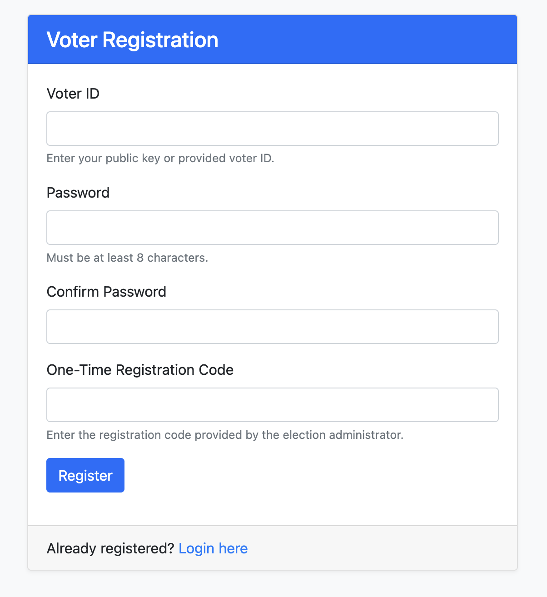

# Blockchain Voting System


This project implements a complete end-to-end solution for conducting elections with cryptographic security guarantees.

## Table of Contents

- [Overview](#overview)
- [Features](#features)
- [System Architecture](#system-architecture)
- [Installation](#installation)
- [Running the System](#running-the-system)
  - [Administrator Guide](#administrator-guide)
  - [Voter Guide](#voter-guide)
- [Security Mechanisms](#security-mechanisms)
- [File Structure](#file-structure)
- [Development Guide](#development-guide)
- [License](#license)

---

## Overview

This blockchain voting system provides a robust platform for conducting secure elections. It leverages blockchain technology to ensure vote integrity, transparency, and voter privacy. The system includes administrative tools for election management and a user-friendly web interface for voters.


---

## Features

Blockchain-based ledger with immutable vote records  
Cryptographic security with SHA-256 hashing  
Digital signatures for vote authentication  
Mining algorithm (Proof of Work) for blockchain consensus  
Decentralized P2P network for redundancy and security  

### Security Features

Homomorphic encryption for private vote tallying  
Multi-factor authentication for voters and administrators  
Blind signatures for voter privacy  
Ring signatures for anonymous vote verification  

### Admin Features

Election lifecycle management (setup, registration, voting, tallying)  
Candidate management system  
Voter registration with verification  
Real-time monitoring tools  
Report generation for participation and results  

### Voter Features

User-friendly web interface  
Secure authentication system  
Vote casting with confirmation  
Vote verification capabilities  
Result viewing after election completion  

---

## System Architecture

The system consists of three main components:


1. **Network**: Distributed nodes maintaining the election blockchain  
2. **Admin Interface**: Command-line tools for election management  
3. **Voter Frontend**: Web interface for participation in the election  

---

## Installation

### Prerequisites

- Python 3.7 or higher
- pip package manager

### Setup Process

```bash
git clone https://github.com/yourusername/blockchain-voting.git
cd blockchain-voting
```

Create a virtual environment (recommended):

```bash
python -m venv venv
source venv/bin/activate  # On Windows: venv\Scripts\activate
```

Install dependencies:

```bash
pip install cryptography flask flask-wtf flask-login qrcode pillow cmd
```

Create necessary directories:

```bash
mkdir -p data
mkdir -p docs/images
```

---

## Running the System

The system has three main components:

- Blockchain Node: The core blockchain network
- Admin Interface: For election management
- Web Frontend: For voters to participate

### Starting the System

Open three separate terminal windows and run:

**Terminal 1: Blockchain Node**

```bash
python main.py node 8333
```

**Terminal 2: Admin Interface**

```bash
python main.py admin
```

**Terminal 3: Web Frontend**

```bash
python main.py web
```

The web interface will be accessible at: [http://localhost:5000](http://localhost:5000)


---

## First-Time Setup

When first running the admin interface, you'll be prompted to create an admin account:

```text
Enter admin username: admin
Enter admin password: ********
```

### Login and Basic Commands

```text
admin> login
Username: admin
Password: ********
Enter OTP code: 123456
```

---

## Election Configuration

```text
admin(admin)> set_title Presidential Election 2025
admin(admin)> set_description A secure blockchain-based election for selecting the next president.
```

### Managing Candidates

```text
admin(admin)> add_candidate
Candidate name: John Smith
Party (optional): Democratic Party
Bio (optional): Former governor with 20 years of public service experience

admin(admin)> list_candidates
```

### Election Lifecycle Management

```text
# Start voter registration
admin(admin)> change_state REGISTRATION

# Register voters
admin(admin)> register_voter
Enter voter public key: voter1
OTP code for voter: 987654

# Open voting
admin(admin)> change_state VOTING

# Close voting and tally
admin(admin)> change_state TALLYING

# View results
admin(admin)> tally_votes

# Close election
admin(admin)> change_state CLOSED
```

### Generating Reports

```text
admin(admin)> generate_report
Select report type (1-3): 2
```


---

## Voter Guide

Navigate to [http://localhost:5000/register](http://localhost:5000/register)

Complete the registration form:

- **Voter ID**: The public key or ID registered by the admin  
- **Password**: Create a secure password  
- **One-Time Registration Code**: The OTP provided by the administrator  



### Login

Visit [http://localhost:5000/login](http://localhost:5000/login)  
Enter your credentials:

- Voter ID  
- Password  
- Complete two-factor authentication using the provided OTP  

### Casting a Vote

- After login, you'll be directed to the voting page  
- Select your candidate  
- Confirm your choice  
- Submit your vote  


### Viewing Results

Once the election is in `TALLYING` or `CLOSED` state, navigate to:  
[http://localhost:5000/results](http://localhost:5000/results)


---

## Blockchain and Hashing

The system uses SHA-256 hashing to create an immutable chain of blocks. Each block contains:

- Index  
- Timestamp  
- Previous block hash  
- Transactions (votes)  
- Nonce (for Proof of Work)  
- Current block hash  

```python
# Block hashing example
def calculate_block_hash(self):
    return calculate_hash(
        self.index,
        self.previous_hash,
        self.timestamp,
        self.transactions,
        self.nonce
    )
```

---

## Digital Signatures

RSA-based digital signatures ensure:

- Only the legitimate voter can cast their vote (authentication)  
- Votes cannot be altered after submission (integrity)  
- Voters cannot deny having cast their vote (non-repudiation)  

```python
# Transaction signing example
def sign_transaction(self, private_key):
    transaction_hash = self.calculate_hash()
    self.signature = sign_data(transaction_hash, private_key)
```

---

## Mining Algorithm

A Proof of Work consensus mechanism secures the blockchain:

- Adjustable difficulty  
- Requires computational work to add blocks  
- Prevents tampering with historical votes  

```python
# Mining example
def mine(self):
    nonce = 0
    while True:
        self.block.nonce = nonce
        current_hash = self.block.calculate_block_hash()
        if current_hash.startswith(self.target):
            self.block.hash = current_hash
            return self.block
        nonce += 1
```

---

## Homomorphic Encryption

Enables vote counting without revealing individual votes:

```python
# Simplified homomorphic tallying
def aggregate_encrypted_votes(self, encrypted_votes):
    result = 1
    for vote in encrypted_votes:
        result = (result * vote) % self.n
    return result
```

---

## File Structure

```
blockchain_voting/
├── blockchain/               # Core blockchain implementation
│   ├── block.py
│   ├── blockchain.py
│   ├── transaction.py
│   ├── voter_registry.py
│   └── wallet.py
├── mining/
│   └── proof_of_work.py
├── network/
│   ├── node.py
│   ├── server.py
│   ├── message.py
│   └── peer.py
├── security/
│   ├── homomorphic.py
│   ├── multi_factor_auth.py
│   ├── blind_signature.py
│   └── ring_signature.py
├── admin/
│   ├── auth.py
│   ├── election.py
│   ├── candidates.py
│   ├── reports.py
│   └── interface.py
├── frontend/
│   ├── app.py
│   ├── routes.py
│   ├── forms.py
│   ├── static/
│   └── templates/
├── utils/
│   ├── hash_util.py
│   └── persistence.py
├── api/
│   ├── routes.py
│   └── auth.py
├── data/
└── main.py
```

---

## Development Guide

### Adding New Features

- **Extending the Blockchain**: Modify `blockchain/blockchain.py`
- **Enhancing Security**: Add to the `security/` directory
- **Improving the UI**: Update `frontend/templates/` and `frontend/static/`
- **Adding Admin Features**: Extend `admin/interface.py`

### Adding Pictures to the README

- Create a `docs/images/` directory  
- Add your images to this directory  
- Reference them in the README using Markdown:

```markdown

```

Suggested images:

- System architecture diagram  
- Admin interface screenshot  
- Voter interface screenshot  
- Blockchain structure  
- Security mechanism diagrams  

---

