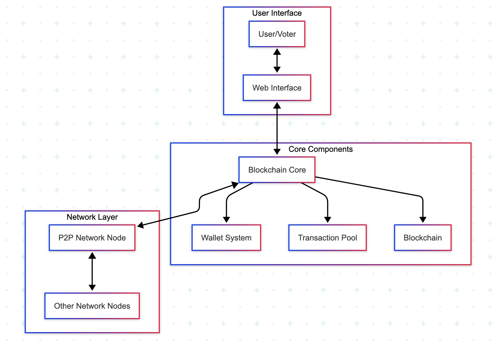
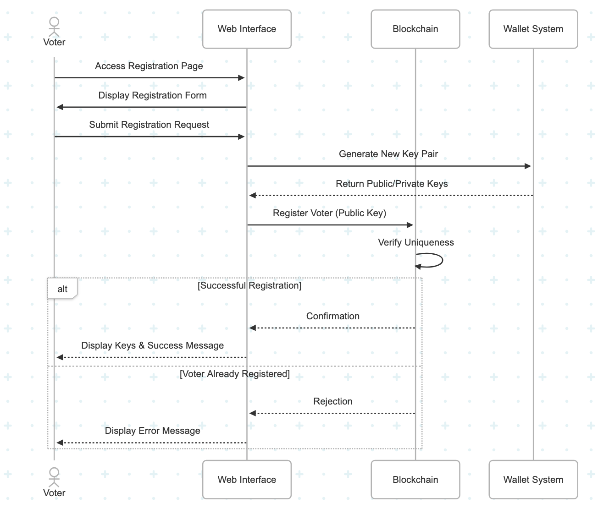
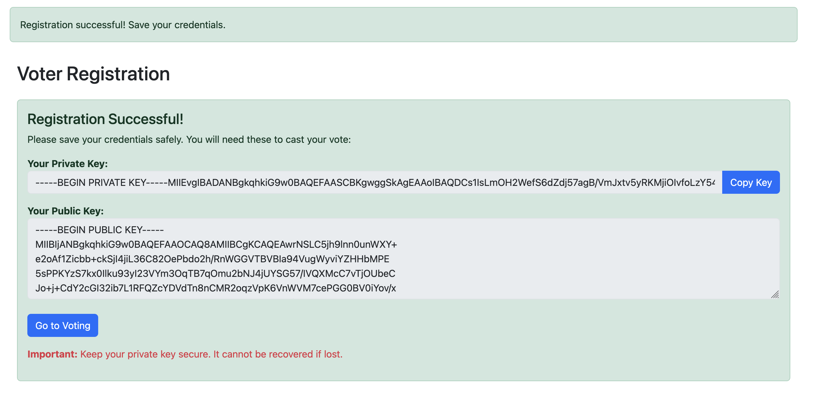
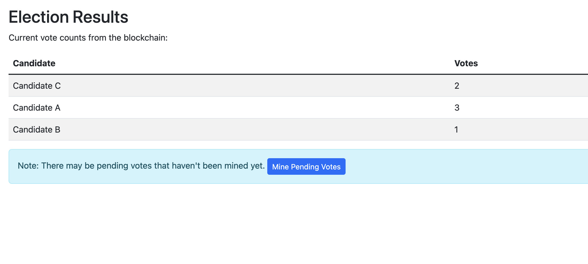

# Blockchain Voting System

A secure, transparent, and decentralized electronic voting system built on blockchain technology.

## Introduction

This blockchain voting system provides a tamper-proof solution for conducting elections while ensuring voter privacy and ballot integrity. By using cryptographic principles and distributed ledger technology, the system creates a transparent voting process.

## Architecture

The system consists of three primary components:



## Blockchain Implementation Details

### Hashing Implementation

The system uses SHA-256 cryptographic hashing to create unique block identifiers and maintain chain integrity. Each block's hash depends on its content and the previous block's hash, creating a tamper-evident chain.

`blockchain/block.py`:
```python
def calculate_hash(self):
    block_string = json.dumps(self.to_dict(), sort_keys=True).encode()
    return hashlib.sha256(block_string).hexdigest()
```

### Digital Signature Implementation

Digital signatures ensure that votes can only be cast by authorized voters and cannot be modified after submission. The system utilizes RSA asymmetric cryptography for signing and verification.

`blockchain/wallet.py`:
```python
def sign_data(self, data):
    if isinstance(data, str):
        data = data.encode()
    
    private_key_obj = serialization.load_pem_private_key(
        self.private_key.encode(),
        password=None
    )
    
    signature = private_key_obj.sign(
        data,
        padding.PSS(
            mgf=padding.MGF1(hashes.SHA256()),
            salt_length=padding.PSS.MAX_LENGTH
        ),
        hashes.SHA256()
    )
    
    return base64.b64encode(signature).decode('utf-8')
```

### Mining (Proof of Work) Implementation

The blockchain is secured through a Proof of Work consensus mechanism that requires computational work to add new blocks, preventing tampering and ensuring agreement across the network.

`blockchain/blockchain.py`:
```python
def mine_pending_transactions(self, miner_address):

    self.add_transaction(Transaction("SYSTEM", miner_address, {"reward": self.mining_reward}))
    
    block = Block(
        index=len(self.chain),
        timestamp=time.time(),
        transactions=self.pending_transactions,
        previous_hash=self.chain[-1].hash
    )
    
    block.mine_block(self.difficulty)
    self.chain.append(block)
    self.pending_transactions = []
    
    return block
```

## Voting Process Flow



## Frontend Screenshots

### Voter Registration Page  


### Results Dashboard  


## Installation

1. Clone the repository:
```bash
git clone https://github.com/yourusername/blockchain-voting.git
cd blockchain-voting
```

2. Create and activate a virtual environment:
```bash
python -m venv venv
source venv/bin/activate  # On Windows: venv\Scripts\activate
```

3. Install dependencies:
```bash
pip install -r requirements.txt
```

4. Run the application:
```bash
python main.py
```

5. Access the web interface at [http://localhost:5000](http://localhost:5000)


## Project Structure

```text
blockchain-voting/
├── blockchain/                  # Core blockchain implementation
│   ├── __init__.py
│   ├── block.py                 # Block implementation with hashing
│   ├── blockchain.py            # Blockchain with mining implementation
│   ├── transaction.py           # Transaction implementation
│   └── wallet.py                # Wallet with digital signature implementation
├── network/                     # P2P networking components
│   ├── __init__.py
│   └── node.py                  # Network node implementation
├── web/                         # Web interface
│   ├── __init__.py
│   ├── app.py                   # Flask app setup
│   ├── routes.py                # Web routes implementation
│   └── templates/               # HTML templates
│       ├── base.html
│       ├── index.html
│       ├── register.html
│       ├── vote.html
│       └── results.html
├── main.py                      # Application entry point
└── requirements.txt             # Project dependencies
```

